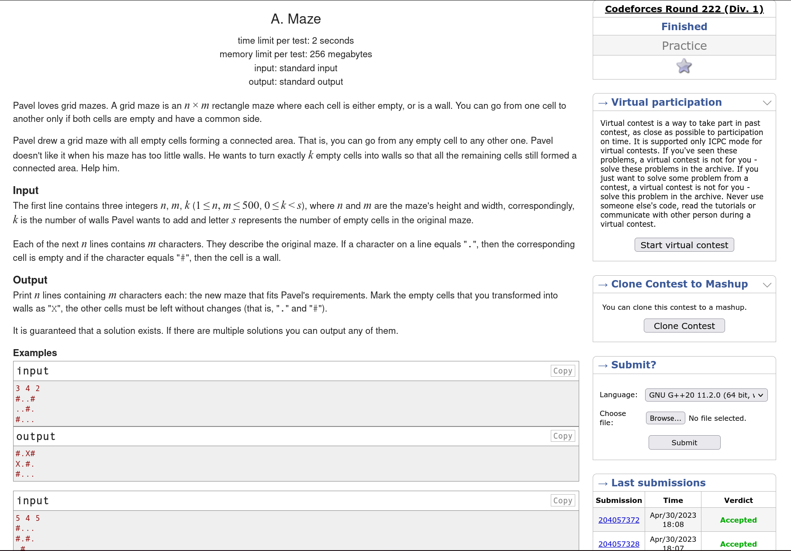
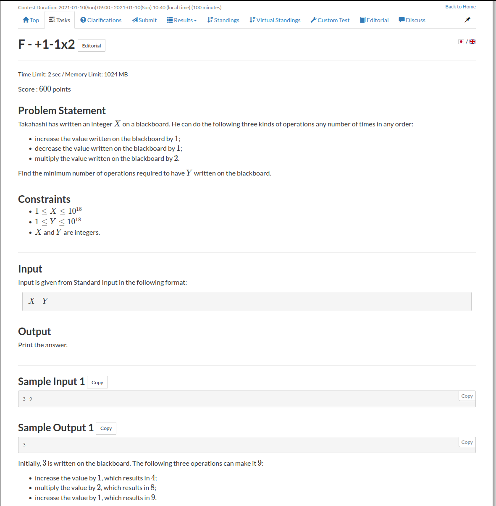
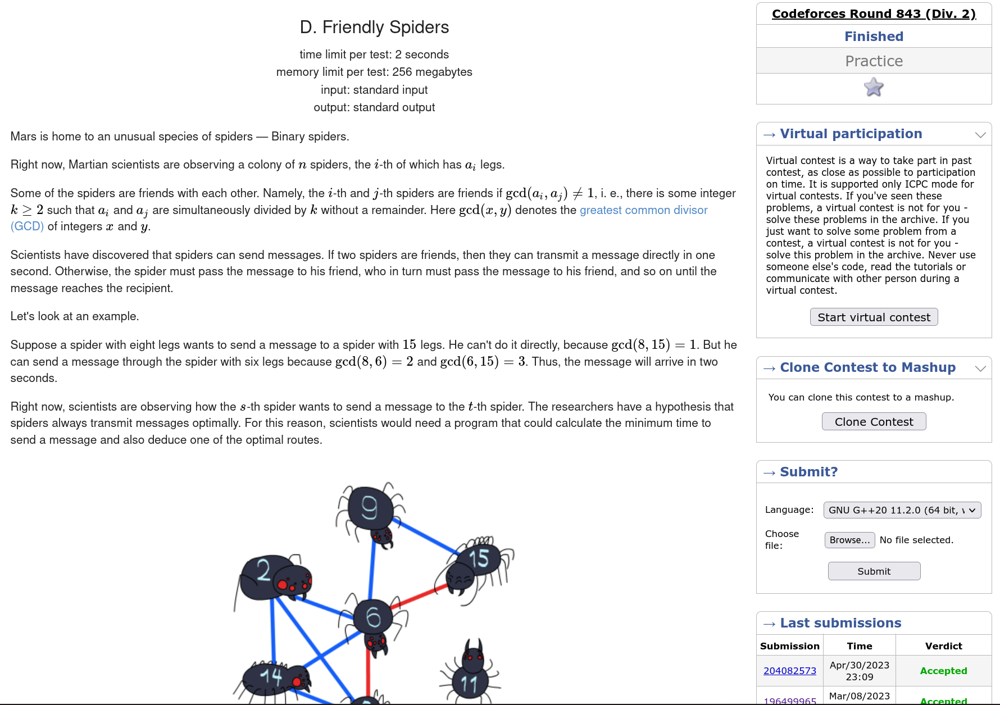
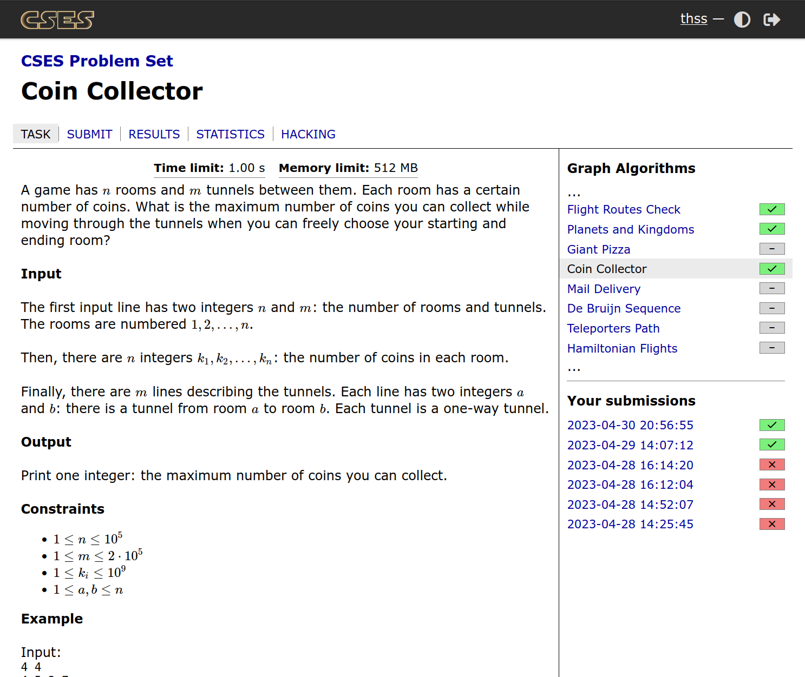

# Exercícios CP

**Número da Lista**: 43 
**Conteúdo da Disciplina**: Grafos 1 

## Alunos
|Matrícula | Aluno |
| -- | -- |
| 19/0117401  |  Thalisson Alves G. de Jesus |

## Sobre 
Os exercícios foram selecionados de diversas fontes, como Codeforces, CSES e AtCoder. Cada exercício possui uma pasta com o seu nome e dentro dela há um arquivo com a solução em C++.

## Screenshots

### Exercício 1 - [Maze](./Maze/)

**Conteúdo**:
- DFS/BFS

### Exercício 2 - [+1-1x2](./%2B1-1x2/)

**Conteúdo**:
- BFS

### Exercício 3 - [Friendly Spiders](./Friendly-Spiders/)
**Conteúdo**:
- Grafo Bipartido
- BFS
- Teoria dos números

### Exercício 4 - [Coin Collector](./Coin-Collector/)
**Conteúdo**:
- DFS
- Componentes fortemente conectados
- Grafo condensado
- DP

## Instalação 
**Linguagem**: C++ 
**Framework**: (caso exista) 
**Pré-requisitos**: gcc, g++

## Uso 

Para submeter as soluções siga os passos abaixo.

1. Entre na página do exercício, um link para ela pode ser encontrado no título `README.md` do exercício desejado.
2. Copie o código `solution.cpp` da mesma pasta que o `README.md`.
3. Submeta o código copiado no juiz online.

## Outros 

TODO: link para o vídeo
